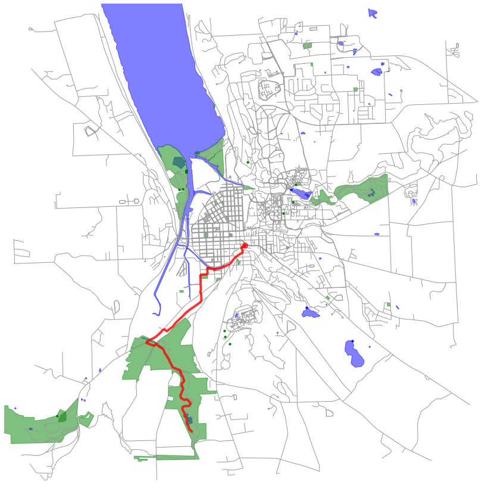

# Generating Ideal Running Routes

As an avid cyclist and runner, I'm often confronted with the tedious task of designing new routes.
There are several factors that go into this design including but not limited to mileage, elevation change, destination type (if any), overall difficulty, scenery, path type, etc.
I personally enjoy running around 8 km at a time around nearby lakes while avoiding steep hills.
Finding a route aligned with these preferences ultimately amounts to some solving some optimization problem.
Since I often I want to forgo the routing process and just go run, I've decided to formally set up and solve this problem.

# The Model

For this project, I use the OpenStreetMap API via the OSMnx package in conjuction with elevation and place data from the Google Maps API.
OpenStreetMaps is essentially an open source version of Google Maps and OSMnx is a Python package for simplifying OpenStreetMap API calls and constructing street networks.
Together they allow you to build undirected graphical models of roads that can be used for route planning.
As suggested by its name, the Elevation API from Google Maps provides detailed elevation data for given locations allowing us to compute net elevation changes and route difficulty.
Similarly, the Place API from Google Maps contains the detailed information about points of interest including user reviews.
Note that Google does not offer graphical models of road networks and scraping this is against their terms of service. Hence our use of OSMnx.

Given this information, we may engineer edge features containing effective impedance information for different route attributes.
Once a user specifies their preferences as a linear weighting on these attributes, we may consolidate these features and search for optimal routes.
Unfortunately, finding an exact solution to our optimization is NP-hard so we settle on an approximate approach that we find to perform well in practice.
We use Dijkstra's algorithm to find the shortest path between all nodes in our weighted graph. These are used to build loops rooted at three points.
Searching through all such loops and adding a penalty for those that differ from our target mileage, we may find our approximate solution.

Examples for Ithaca, NY (where I live) may be found below:

Searching for 15.5 km routes near parks:

  
   

Searching for 15.5 km routes near bodies of water:

  
  

  

Searching for 15.5 km routes near parks and water:

  
  

  
